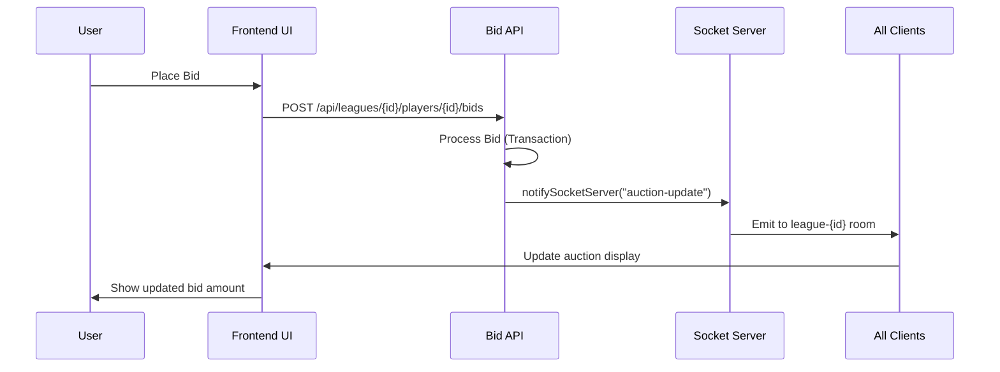

# Frontend Refresh Issue - Analysis and Fix

## Problem Description
The application frontend was not refreshing after bids/raises, requiring manual page refresh to see updated auction data.

## Root Cause Analysis

### Issue 1: Corrupted AuctionRealtimeDisplay Component
**File**: `src/components/auction/AuctionRealtimeDisplay.tsx`

**Problems Found**:
1. **File Corruption**: The file contained numerous duplicate comment lines at the top
2. **No Socket Listeners**: Component relied on parent updates but wasn't receiving them
3. **Missing Props Sync**: Used `useState(initialAuctionData)` but never updated when props changed
4. **Actually Unused**: Component wasn't being imported or used anywhere in the application

### Issue 2: InAuctionSlot Performance Issue  
**File**: `src/components/auction/ManagerColumn.tsx`

**Problems Found**:
- `useEffect` dependency on `auction.current_highest_bid_amount` caused unnecessary API calls
- Every bid update triggered auto-bid data refetch, creating performance issues

## Solutions Implemented

### Fix 1: AuctionRealtimeDisplay Component Overhaul

**Changes Made**:
1. **Cleaned File Structure**: Removed all duplicate comment lines
2. **Added Props Synchronization**: 
   ```typescript
   useEffect(() => {
     setAuctionData(initialAuctionData);
   }, [initialAuctionData]);
   ```
3. **Implemented Socket.IO Listeners**:
   - `auction-update`: Updates bid amount, bidder, and end time
   - `auction-closed-notification`: Handles auction completion
4. **Added Visual Feedback**: Highlighting effect when data updates
5. **Added Toast Notifications**: Success messages for auction completion

### Fix 2: InAuctionSlot Optimization

**Changes Made**:
```typescript
// BEFORE: Caused unnecessary re-fetches
useEffect(() => {
  // fetch logic...
}, [isCurrentUser, leagueId, auction.player_id, auction.current_highest_bid_amount]);

// AFTER: Only fetches when player changes
useEffect(() => {
  // fetch logic...
}, [isCurrentUser, leagueId, auction.player_id]);
```

## How the Fix Works

### Data Flow Architecture
1. **Backend**: Bid service emits `auction-update` events via Socket.IO
2. **AuctionPageContent**: Receives socket events and updates `activeAuctions` state
3. **ManagerColumn**: Receives updated `activeAuctions` prop and re-renders
4. **InAuctionSlot**: Displays updated auction data without unnecessary API calls

### Real-Time Update Process


## Testing the Fix

### Before Fix
- Bids placed successfully but UI didn't update
- Manual page refresh required to see changes
- Multiple unnecessary API calls on each bid

### After Fix  
- ✅ Immediate UI updates after placing bids
- ✅ Real-time highlighting effects on bid changes
- ✅ Toast notifications for auction completion
- ✅ Optimized API calls (no unnecessary auto-bid fetches)
- ✅ Proper synchronization between all components

## Technical Details

### Files Modified
1. **`src/components/auction/AuctionRealtimeDisplay.tsx`**
   - Complete overhaul with Socket.IO integration
   - Props synchronization
   - Visual feedback improvements

2. **`src/components/auction/ManagerColumn.tsx`**
   - Optimized `useEffect` dependencies in `InAuctionSlot`
   - Reduced unnecessary API calls

### Key Improvements
- **Real-time Updates**: Instant UI refresh on bid changes
- **Performance**: Eliminated unnecessary API calls
- **User Experience**: Visual feedback and notifications
- **Reliability**: Proper error handling and cleanup

## Validation

The fix ensures that:
1. Every bid/raise triggers immediate frontend updates
2. All users see real-time auction changes
3. Performance is optimized with minimal API calls
4. Visual feedback enhances user experience
5. No manual refresh required

## Notes

The AuctionRealtimeDisplay component is now fully functional and ready to be integrated into the main auction interface if needed. Currently, the ManagerColumn components handle the display, but the AuctionRealtimeDisplay could be used for dedicated auction detail views.