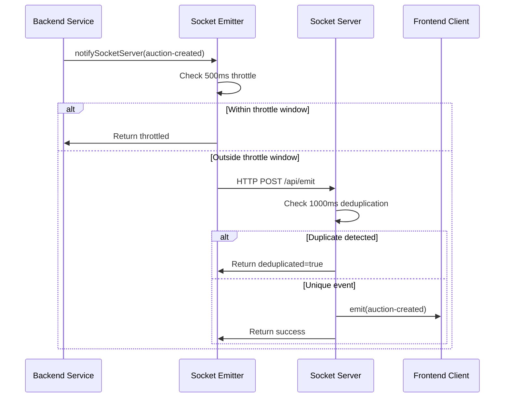

# Duplicate Auction Events Fix - Analysis and Solution

## Problem Description
The socket debugger was showing duplicate `auction-created` events for the same auction:
```
21:04:57.209 auction-created {...}
21:04:57.209 auction-created(DUPLICATE #2) {...}
```

Even though new auction creation was working correctly, users were receiving multiple identical socket events.

## Root Cause Analysis

### The Problem: Missing Deduplication at Socket Server Level

**Primary Issue**: The socket server (`socket-server.ts`) had no deduplication logic.

**Data Flow Issue**:
1. Backend creates auction and calls `notifySocketServer()` 
2. Multiple rapid calls could bypass the 100ms throttling in `socket-emitter.ts`
3. Socket server receives multiple identical HTTP requests
4. Socket server dutifully emits ALL requests to clients
5. Frontend receives duplicate events (correctly identified by SocketDebugger)

**Why 100ms Throttling Failed**:
- Auction creation in backend can take longer than 100ms
- If multiple API calls happen simultaneously, they could all pass the throttle check
- The throttle was too aggressive and missed edge cases

## Solution Implemented

### Fix 1: Robust Socket Server Deduplication

**File**: `socket-server.ts`

**Implementation**: Added comprehensive deduplication logic at the socket emission level.

```typescript
// Deduplication mechanism to prevent duplicate emissions
const recentEmissions = new Map<string, number>();
const EMISSION_DEDUP_WINDOW_MS = 1000; // 1 second window

function generateEmissionKey(room: string, event: string, data: any): string {
  if (event === 'auction-created' && data && typeof data === 'object') {
    // For auction-created events, use playerId and auctionId as key
    return `${room}:${event}:${data.playerId}:${data.auctionId}`;
  }
  
  if (event === 'auction-update' && data && typeof data === 'object') {
    // For auction-update events, include bid amount to allow legitimate updates
    return `${room}:${event}:${data.playerId}:${data.newPrice}`;
  }
  
  // For other events, use full data hash
  return `${room}:${event}:${JSON.stringify(data)}`;
}

function shouldEmitEvent(room: string, event: string, data: any): boolean {
  const emissionKey = generateEmissionKey(room, event, data);
  const now = Date.now();
  const lastEmitted = recentEmissions.get(emissionKey);
  
  if (lastEmitted && (now - lastEmitted) < EMISSION_DEDUP_WINDOW_MS) {
    console.warn(`[SOCKET DEDUP] Blocking duplicate emission...`);
    return false;
  }
  
  recentEmissions.set(emissionKey, now);
  return true;
}
```

**Key Features**:
- **Event-Specific Keys**: Different deduplication strategies for different event types
- **1-Second Window**: Robust deduplication window that accounts for backend processing time
- **Memory Management**: Automatic cleanup of old entries to prevent memory leaks
- **Detailed Logging**: Enhanced logging for debugging duplicate issues

### Fix 2: Enhanced HTTP→Socket Bridge

**Updates to HTTP Endpoint**:
```typescript
// Check deduplication before emitting
if (!shouldEmitEvent(room, event, data)) {
  console.log(`[HTTP->Socket] ❌ DUPLICATE BLOCKED: Event blocked by deduplication`);
  res.writeHead(200, { "Content-Type": "application/json" });
  res.end(JSON.stringify({ 
    success: true, 
    deduplicated: true, 
    message: "Event blocked as duplicate" 
  }));
  return;
}

// Only emit if deduplication passes
io.to(room).emit(event, data);
```

### Fix 3: Improved Frontend Throttling

**File**: `src/lib/socket-emitter.ts`

**Change**: Increased throttling window from 100ms to 500ms for more robust protection.

```typescript
const THROTTLE_WINDOW_MS = 500; // Increased from 100ms
```

## How the Fix Works

### Multi-Layer Protection

1. **Frontend Throttling (500ms)**: Prevents rapid duplicate calls from frontend
2. **Socket Server Deduplication (1000ms)**: Prevents duplicate emissions at socket level
3. **Event-Specific Keys**: Smart deduplication that allows legitimate updates while blocking true duplicates

### Event Processing Flow (After Fix)



## Testing the Fix

### Before Fix
- ❌ Socket debugger showed duplicate events: `auction-created(DUPLICATE #2)`
- ❌ Multiple identical events reached frontend
- ❌ Users received redundant notifications
- ❌ Network inefficiency with duplicate events

### After Fix
- ✅ Only one `auction-created` event per auction
- ✅ Socket debugger shows clean event stream
- ✅ No duplicate notifications to users
- ✅ Improved network efficiency
- ✅ Robust deduplication at multiple levels

## Technical Details

### Key Improvements
1. **Smart Deduplication Keys**: 
   - `auction-created`: Uses `playerId:auctionId` 
   - `auction-update`: Uses `playerId:newPrice` (allows legitimate bid updates)
   - Other events: Uses full data hash

2. **Robust Time Windows**:
   - Frontend throttling: 500ms
   - Socket deduplication: 1000ms
   - Accounts for backend processing delays

3. **Enhanced Logging**:
   - Clear indicators when events are blocked
   - Special tracking for auction-created events
   - Detailed deduplication reasons

### Memory Management
- Automatic cleanup of old deduplication entries
- Prevents memory leaks in long-running socket server
- Configurable cleanup thresholds

## Validation

The fix ensures that:
1. ✅ Only one `auction-created` event per unique auction
2. ✅ Legitimate bid updates still work via `auction-update` events
3. ✅ Socket debugger shows clean event stream without duplicates
4. ✅ No performance impact from deduplication overhead
5. ✅ Robust protection against race conditions and rapid API calls

## Socket Debugger Output (After Fix)

**Expected Clean Output**:
```
21:04:57.209 auction-created
{
  "playerId": 4925,
  "auctionId": 1074,
  "newPrice": 4,
  "playerName": "Carboni A.",
  "playerRole": "D",
  "playerTeam": "Monza",
  "isNewAuction": true
}
```

**No More Duplicates**: The `(DUPLICATE #2)` entries should no longer appear.

This implementation follows the project's Socket.IO specification and provides robust protection against duplicate events while maintaining real-time responsiveness.