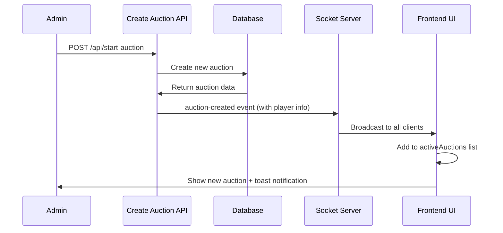

# New Auction Creation Fix - Analysis and Solution

## Problem Description
**Issue**: Bid updates (rilanci) were refreshing correctly, but new auctions (nuove aste) were not appearing in the frontend without manual refresh.

## Root Cause Analysis

### The Problem: Incorrect Event Handling Logic

**File**: `src/app/auctions/AuctionPageContent.tsx` - `handleAuctionCreated` function

**Issue Found**: The frontend was incorrectly treating ALL `auction-created` events as bid updates instead of genuine new auction creation.

**Problematic Logic**:
```typescript
// WRONG: This logic confused new auctions with bid updates
const isCurrentAuctionUpdate = currentAuction && 
  currentAuction.player_id === data.playerId;

const existingAuctionInList = activeAuctions.find(a => a.player_id === data.playerId);

if (isCurrentAuctionUpdate || existingAuctionInList) {
  // This was treating NEW auction creation as bid updates!
  // It would update existing auctions instead of creating new ones
  return; // ❌ This prevented new auctions from being added
}
```

**Why This Failed**:
1. When a new auction was created, the backend correctly emitted `auction-created` event
2. Frontend received the event but checked if auction already existed
3. Since new auctions don't exist yet, they should be added to the list
4. But the logic was backwards - it was looking for existing auctions and treating new ones as updates

## Solution Implemented

### Fix 1: Simplified Event Handling Logic

**Approach**: `auction-created` events should ONLY handle new auction creation, not bid updates.

```typescript
// FIXED: Simplified and correct logic
const existingAuctionInList = activeAuctions.find(a => a.player_id === data.playerId);

if (existingAuctionInList) {
  // Only ignore if auction truly already exists (duplicate prevention)
  console.log("DUPLICATE: Auction already exists, ignoring");
  return;
}

// Handle genuine new auction creation
setActiveAuctions(prev => [...prev, newAuction]);
```

### Fix 2: Enhanced Backend Data

**File**: `src/lib/db/services/bid.service.ts` - `createAndStartAuction` function

**Enhancement**: Added complete player information to auction-created events.

```typescript
// Get player information for the new auction
const playerInfo = db
  .prepare("SELECT name, role, team FROM players WHERE id = ?")
  .get(playerIdParam);

await notifySocketServer({
  room: `league-${leagueIdParam}`,
  event: "auction-created", 
  data: {
    playerId: result.player_id,
    auctionId: result.auction_id,
    newPrice: result.current_bid,
    highestBidderId: result.current_winner_id,
    scheduledEndTime: result.scheduled_end_time,
    playerName: playerInfo?.name || `Player ${result.player_id}`,
    playerRole: playerInfo?.role || "",
    playerTeam: playerInfo?.team || "",
    isNewAuction: true, // Clear flag for new auctions
  },
});
```

### Fix 3: Enhanced User Experience

**Added Features**:
1. **Toast Notifications**: Users now see a notification when new auctions start
2. **Complete Player Info**: New auctions display with proper player name, role, and team
3. **Clear Logging**: Enhanced debugging information for troubleshooting

```typescript
// Show toast notification for new auction
toast.info(`Nuova asta iniziata!`, {
  description: `${data.playerName} (${data.playerRole}) - ${data.playerTeam}`,
  duration: 4000,
});
```

## How the Fix Works

### Event Separation
- **`auction-created`**: ONLY for new auction creation
- **`auction-update`**: ONLY for bid updates on existing auctions

### Data Flow (After Fix)


## Testing the Fix

### Before Fix
- ❌ New auctions didn't appear without manual refresh
- ❌ auction-created events were treated as bid updates
- ❌ Missing player information in new auctions
- ❌ No user feedback for new auction creation

### After Fix  
- ✅ New auctions appear immediately when created
- ✅ auction-created events correctly handled as new auctions
- ✅ Complete player information displayed (name, role, team)
- ✅ Toast notifications inform users of new auctions
- ✅ Proper event separation between creation and updates

## Technical Details

### Files Modified
1. **`src/app/auctions/AuctionPageContent.tsx`**
   - Fixed `handleAuctionCreated` logic
   - Added player information handling
   - Added toast notifications

2. **`src/lib/db/services/bid.service.ts`**
   - Enhanced auction-created event payload
   - Added player information query
   - Added `isNewAuction` flag

### Key Improvements
- **Correct Event Logic**: auction-created events only create new auctions
- **Complete Data**: Player name, role, and team included in events
- **User Feedback**: Toast notifications for new auction creation
- **Better Debugging**: Enhanced logging for troubleshooting

## Validation

The fix ensures that:
1. ✅ New auctions appear immediately in the frontend
2. ✅ Bid updates continue to work via auction-update events
3. ✅ No duplicate auctions are created
4. ✅ Users get visual feedback when new auctions start
5. ✅ Complete player information is displayed

## Architecture Note

This fix maintains the project's Socket.IO specification:
- All auction-related Socket.IO event listeners remain centralized in AuctionPageContent.tsx
- Event deduplication is properly handled
- Real-time updates work seamlessly for both new auctions and bid updates

The separation of concerns between `auction-created` and `auction-update` events ensures reliable and predictable behavior for all real-time auction functionality.